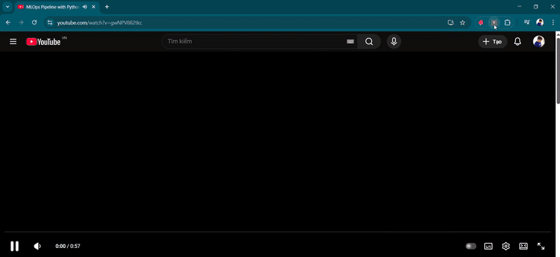
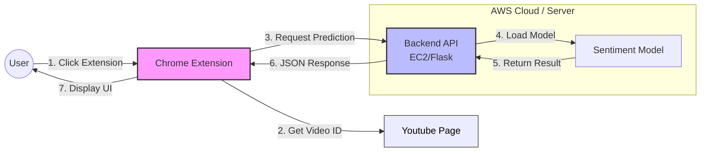

# Youtube Sentiment Analysis

<p align="center">
  
</p>

This project builds an End-to-End Machine Learning system for Sentiment Analysis based on Youtube comments. It utilizes DVC for data pipeline management and implements automated deployment (CI/CD) to AWS using Github Actions.

## Table of Contents
- [System Overview](#system-overview)
- [Installation Instructions](#installation-instructions)
  - [Prerequisites](#prerequisites)
  - [Local Setup (Conda)](#local-setup-conda)
  - [DVC Setup](#dvc-setup)
- [Model Experimentation & Selection](#model-experimentation--selection)  
- [How to Run](#how-to-run)
- [Deployment (AWS CI/CD)](#deployment-aws-ci-cd)
  - [IAM & ECR Setup](#1-iam--ecr-setup)
  - [EC2 & Docker Setup](#2-ec2--docker-setup)
  - [Github Actions Setup](#3-github-actions-setup)

---

## System Overview


The system operates as a **Chrome Extension** to analyze the sentiment of Youtube clips. The backend operates based on a CI/CD Deployment flow with Github Actions and AWS:

1. **Build:** Build the source code into a Docker Image.
2. **Push:** Push the Docker Image to AWS ECR (Elastic Container Registry).
3. **Pull & Run:** The EC2 instance (Ubuntu VM) pulls the Image from ECR and runs the Container.

---

## Installation Instructions

### Prerequisites
Before installation, please ensure you have the following:
1. **Youtube API Key:** Obtain an API key from [Google Cloud Platform (GCP)](https://console.cloud.google.com/).
2. **AWS Account:** Required for configuration and deployment resources.

### Local Setup (Conda)
Use Conda to create a virtual environment and install the necessary libraries:

```bash
# Create a new environment
conda create -n youtube python=3.11.0

# Activate the environment
conda activate youtube

# Install dependencies
pip install -r requirements.txt
````

### DVC Setup

This project uses [DVC (Data Version Control)](https://dvc.org/) to manage the pipeline:

```bash
# Initialize DVC
dvc init

# Reproduce the pipeline
dvc repro

# Visualize the pipeline DAG
dvc dag
```

### AWS Configuration (Local)

Configure the [AWS CLI](https://docs.aws.amazon.com/cli/latest/userguide/getting-started-install.html) on your local machine to interact with AWS services:

```bash
aws configure
```

-----

## Model Experimentation & Selection

Before establishing the automated pipeline, an extensive experimentation phase was conducted to identify the optimal approach for this specific dataset.

```mermaid
graph TD
    Data[Raw Data] --> Process[Preprocessing & EDA]
    Process -->|Handle Imbalance| Feat[Feature Engineering]
    
    subgraph "Vectorization Trials"
        Feat --> BOW[Bag of Words]
        Feat --> TFIDF[TF-IDF]
        TFIDF --> MaxFeat[Tuning Max Features]
    end
    
    subgraph "Model Trials"
        MaxFeat --> RF[Random Forest]
        MaxFeat --> XGB["XGBoost 
                              (Hyperparam Tuning)"]
        MaxFeat --> LGBM["LightGBM
                              (Hyperparam Tuning)"]
        MaxFeat --> Ens["Ensemble
                              (LGBM + Logistic Reg)"]
    end
    
    LGBM -->|Best Performance| Final["Final Model: LightGBM"]
    
    style Final fill:#bbf,stroke:#333,stroke-width:2px
````

### Key Experiment Steps:

1.  **Data Analysis & Preprocessing:**

      * Conducted **EDA (Exploratory Data Analysis)** to understand data distribution.
      * Applied text preprocessing techniques.
      * Implemented strategies to handle **unbalanced data** effectively.

2.  **Feature Engineering:**

      * Experimented with different vectorizers: **Bag of Words (BoW)** vs. **TF-IDF**.
      * Fine-tuned the `max_features` parameter in TF-IDF to balance model complexity and performance.

3.  **Model Selection & Hyperparameter Tuning:**
    Tested various algorithms to find the best fit:

      * **Random Forest:** Baseline model.
      * **XGBoost:** Applied hyperparameter tuning.
      * **Ensemble Methods:** Experimented with combining **LightGBM** and **Logistic Regression**.
      * **LightGBM:** Applied detailed hyperparameter tuning.

### Final Decision:

After rigorous evaluation, **LightGBM (with tuned hyperparameters)** was selected as the production model due to its superior balance of accuracy and inference speed.


---


## Deployment (AWS CI/CD)
```mermaid
flowchart TD
    Dev[Developer] -->|Push Code| Github[Github Repo]
    
    subgraph "Github Actions (CI/CD)"
        Build[Build Docker Image]
        Push[Push to AWS ECR]
    end
    
    subgraph "AWS Cloud"
        ECR[(AWS ECR 
        Image Registry)]
        EC2[AWS EC2
        Ubuntu Server]
    end

    Github -->|Trigger| Build
    Build --> Push
    Push -->|Store Image| ECR
    
    Github -->|Trigger Runner| EC2
    EC2 -->|Pull Image| ECR
    EC2 -->|Run Container| Docker[Docker Container]

    style Github fill:#fff,stroke:#333
    style ECR fill:#orange,stroke:#333
    style EC2 fill:#orange,stroke:#333
```

Below are the detailed steps to set up the automated deployment process (CI/CD).

### 1\. IAM & ECR Setup

#### Step 1: Login to AWS Console.

#### Step 2: Create IAM User for Deployment

Create a new User with Programmatic access and attach the following policies:

  * `AmazonEC2ContainerRegistryFullAccess` (To save Docker Images)
  * `AmazonEC2FullAccess` (To manage EC2 instances)

#### Step 3: Create ECR Repo

Create a repository on ECR to store your Docker Images.

  * **Example URI:** `256586140327.dkr.ecr.ap-southeast-2.amazonaws.com/mlopprj`
  * **Repository Name:** `mlopprj`

### 2\. EC2 & Docker Setup

#### Step 4: Create EC2 Machine (Ubuntu)

#### Step 5: Install Docker in EC2 Machine

Connect to your EC2 instance and run the following commands to install Docker:

```bash
# Update system (Optional)
sudo apt-get update -y
sudo apt-get upgrade

# Install Docker (Required)
curl -fsSL https://get.docker.com -o get-docker.sh
sudo sh get-docker.sh

# Add ubuntu user to docker group
sudo usermod -aG docker ubuntu
newgrp docker
```

#### Step 6: Configure EC2 as Self-hosted Runner

To allow Github Actions to control the EC2 instance, you need to install the Runner:

1.  Go to **Github Repo** \> **Settings** \> **Actions** \> **Runners**.
2.  Click **New self-hosted runner**.
3.  Select **Linux** and run the provided commands sequentially on your EC2 terminal.

### 3\. Github Actions Setup

#### Step 7: Setup Github Secrets

Go to Github Repo \> **Settings** \> **Secrets and variables** \> **Actions** and add the following environment variables:

| Secret Name | Value / Description |
| :--- | :--- |
| `AWS_ACCESS_KEY_ID` | The Access Key of the IAM User |
| `AWS_SECRET_ACCESS_KEY` | The Secret Key of the IAM User |
| `AWS_REGION` | e.g., `ap-southeast-2` |
| `AWS_ECR_LOGIN_URI` | ECR URI (excluding the repo name). e.g., `256586140327.dkr.ecr.ap-southeast-2.amazonaws.com` |
| `ECR_REPOSITORY_NAME` | The created repo name. e.g., `mlopprj` |

---

## How to Run

Once the application is running, you can test it via API or the Chrome Extension.

### Option 1: API Testing (Postman)

**Endpoint:** `http://localhost:5000/predict`

**Method:** `POST`

**Sample JSON Body:**

```json
{
    "comments": [
        "This video is awesome! I loved it a lot",
        "Very bad explanation. Poor video"
    ]
}
```

### Option 2: Chrome Extension (Frontend)

1.  Open Chrome and navigate to `chrome://extensions`.
2.  Enable **Developer mode** (toggle at the top right).
3.  Click **Load unpacked** (top left).
4.  Select the folder named `yt-chrome-plugin-frontend`.
5.  Navigate to any Youtube video, open the extension, and view the sentiment analysis based on the comments.